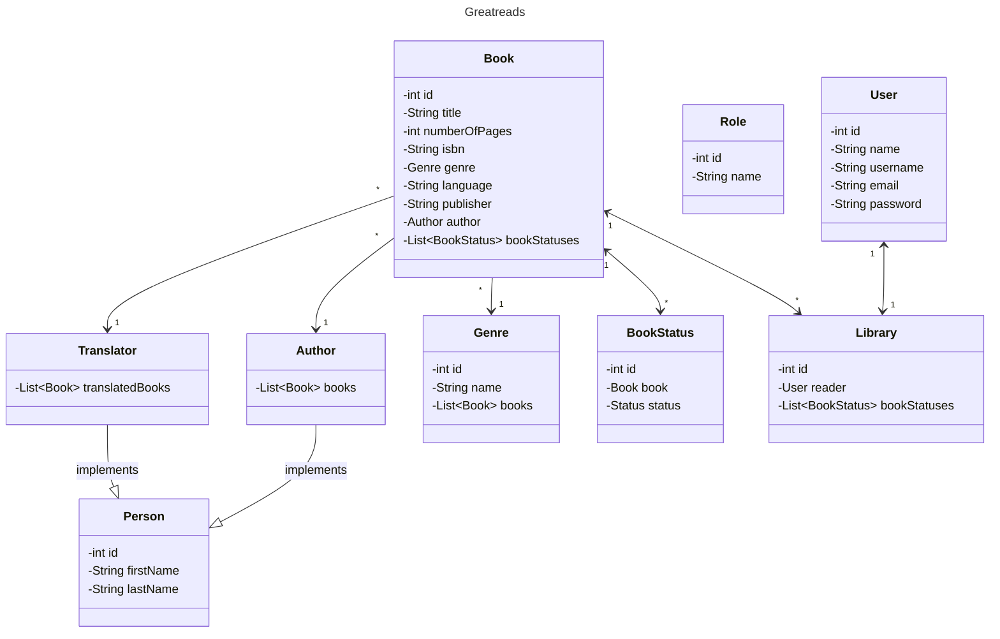
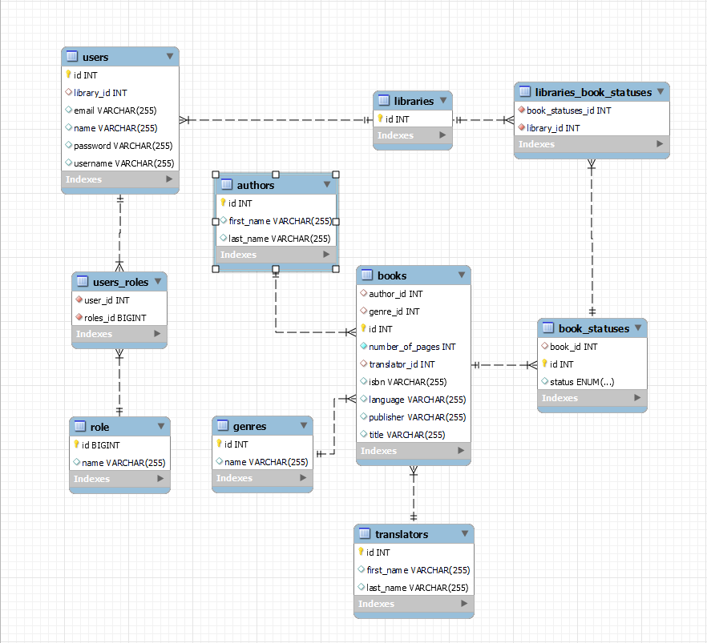

# Greatreads Backend

## Table of Contents

1. [Description](#description)
   - [Core features](#core-features)
2. [Class Diagram](#class-diagram)
3. [Entity Relationship Diagram](#entity-relationship-diagram)
4. [Setup](#setup)
    - [Clone the Repository](#1-clone-the-repository)
    - [Install Maven Dependencies](#2-install-maven-dependencies)
    - [Configure MySQL](#configure-mysql)
    - [First Run](#first-run)
    - [After the First Run](#after-the-first-run)
    - [GitHub Actions](#github-actions)
5. [Technologies Used](#technologies-used)
6. [Controllers and Routes Structure](#controllers-and-routes-structure)
7. [Extra Links](#extra-links)
8. [Future Work](#future-work)
9. [Resources](#resources)

## Description

Greatreads is the final project of the Ironhack Java Backend Bootcamp. It is a Java HTML API inspired by Goodreads, designed to provide a platform for users to discover 
and manage their reading preferences. It offers a simplified version of Goodreads' features while maintaining some of the core functionalities. With Greatreads, users can register, 
interact with books, and organize their reading lists effectively. 

### Core Features
1. **User Registration and Management:** Users can sign up for an account on Greatreads and manage their profiles. The platform supports multiple user roles:

- **Admin**: Administrators have access to administrative features such as managing users and books, adding genres, and deleting authors.
- **Librarian**: Librarians have access to a lower level of administrative features such as creating and updating books, authors, and translators.
- **User**: Regular users can explore books, authors, translators, and manage their reading lists.

2. **Book Management**: Greatreads offers the possibility to manage a reading list of books that users can explore. They can search for books by title, author, or genre.

3. **User's Library**: Each user has a library where they can manage their reading progress. The library includes manages the following reading stages:

- **Want to Read**: Users can add books they're interested in reading.
-  **Currently Reading**: Users can track books they're currently reading.
- **Read**: Once users finish a book, they can mark it as read.

4. **Authentication and Authorization**: Greatreads ensures secure access to user accounts through authentication mechanisms. Different user roles have varying levels of access, ensuring that administrators, librarians, and regular users can perform their respective tasks efficiently.

## Class Diagram


## Entity Relationship Diagram
 

## Setup

Make sure you have the following installed:

- Java (version >= 21)
- MySQL Database
- Maven

### 1. Clone the repository

```shell
git clone https://github.com/evagapi/great-reads.git
cd great-reads
```

### 2. Install Maven dependencies

Using Command Line

```shell
mvn install
```
Using IntelliJ IDEA
- Open IntelliJ IDEA.
- Open the great-reads project.
- Navigate to View > Tool Windows > Maven.
- Click on Reload All Maven Projects icon to update dependencies.
- Alternatively, right-click on pom.xml and select Reload Project.

### Configure MySQL

#### Create your local profile resources file

Create a `application-local.properties` file and include the following properties matching your configuration:

```
spring.datasource.url=jdbc:mysql://localhost:[yourlocalhostport]/[yourdatabasename]?serverTimezone=UTC
spring.datasource.username=[youruser]
spring.datasource.password=[yourpassword]
```

### First Run

The database will be automatically created the first time you run the application with the following configurations:

```shell
spring.profiles.active=local

spring.datasource.driver-class-name=com.mysql.cj.jdbc.Driver

spring.jpa.hibernate.ddl-auto=create

spring.jpa.show-sql=true
```
### After the First Run

After the first run, you need to update the `spring.jpa.hibernate.ddl-auto` to `none` to prevent data overwriting.
You can update `spring.jpa.show-sql` to `false` to disable SQL logging.

### GitHub Actions

This project utilizes GitHub Actions for Continuous Integration (CI) with Maven. 
This GitHub Actions workflow is triggered on pull requests targeting the main branch. 
It sets up the required environment with JDK 21 and Maven. Then, it runs unit tests using Maven. 
This ensures that any code changes introduced via pull requests are tested automatically, providing quick feedback on the project's health and preventing bugs.

## Technologies Used

- Java 21
- Maven
- Spring Boot 3.2.4
- MySQL Database (development database)
- H2 Database (testing and GithubActions database)
- Spring Data JPA
- Spring Web
- Spring Security
- JWT (Java JSON Web Token)
- Lombok
- Spring Boot Starter Test
- Spring Boot Starter Validation
- JUnit Jupiter

## Controllers and Routes structure

You can access the API documentation through http://localhost:8080/swagger-ui/index.html/


## Extra links

- [Project Board](https://github.com/users/evagapi/projects/7)
- [Presentation Slides](https://docs.google.com/presentation/d/1KGe_kfGKYCvUziYOa6jzqd2XOisxolleuFloHlOEOH4/edit?usp=sharing)

## Future work

1. Ratings for Books
- Allow users to rate the books they read.
- Store and display individual user ratings for each book in the database.
- Calculate and display an average rating for each book based on the ratings provided by users.
- Provide sorting and filtering options to explore books based on their ratings.

2. Social Features
- Allow users to connect with each other by adding friends.
- Enable users to make book recommendations to their added friends.

## Resources

- [Spring Security – Roles and Privileges](https://www.baeldung.com/role-and-privilege-for-spring-security-registration)
- [Controller-Service-Repository](https://tom-collings.medium.com/controller-service-repository-16e29a4684e5)
- [Running a Test as a User in Spring MVC Test](https://docs.spring.io/spring-security/reference/servlet/test/mockmvc/authentication.html)
- [Setting Up MockMvc and Spring Security](https://docs.spring.io/spring-security/reference/servlet/test/mockmvc/setup.html)