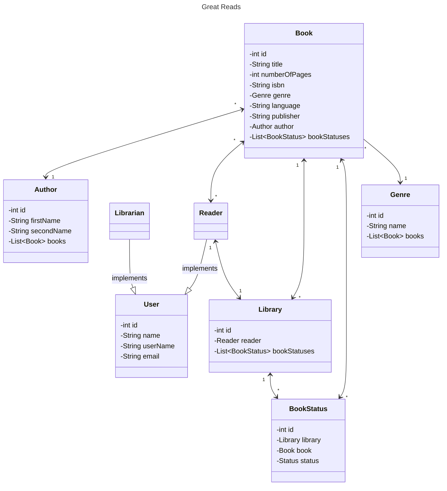

```mermaid
---
title: Great Reads
---
classDiagram
    User : -int id
    User : -String name
    User : -String userName
    User : -String email
    class Reader {
    }
    class Librarian {
    }
    Reader --|> User : implements
    Librarian --|> User : implements
    class Book {
        -int id
        -String title
        -int numberOfPages
        -String isbn
        -Genre genre
        -String language
        -String publisher
        -Author author
        -List~BookStatus~ bookStatuses
    }
    class Author {
        -int id
        -String firstName
        -String secondName
        -List~Book~ books
    }
    Book "*" <--> "1" Author
    Book "*" <--> "*" Reader
    class Genre {
        -int id
        -String name
        -List~Book~ books
    }
    class Library {
        -int id
        -Reader reader
        -List~BookStatus~ bookStatuses
    }
    class BookStatus {
        -int id
        -Library library
        -Book book
        -Status status
    }
    Reader "1" <--> "1" Library
    Library "1" <--> "*" BookStatus
    Book "1" <--> "*" Library
    Book "1" <--> "*" BookStatus
    Book "*" --> "1" Genre


```